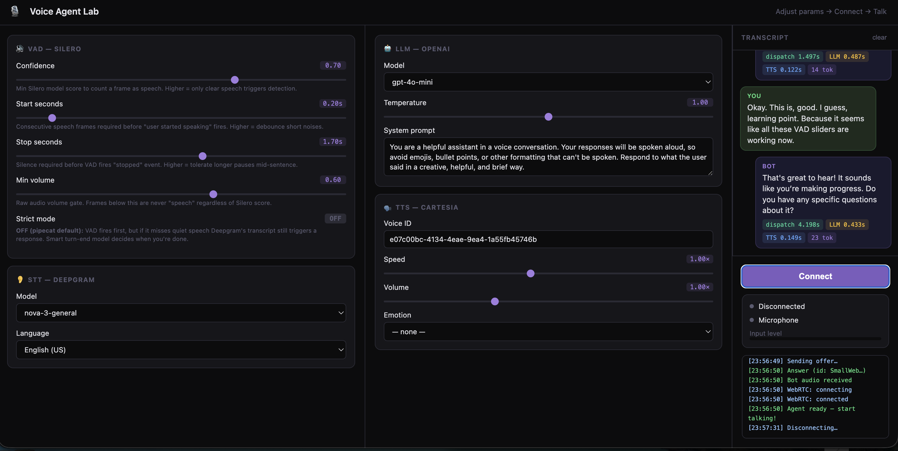

# basic-agent-playground

A Pipecat voice agent extended from the standard quickstart with a browser-based parameter playground for experimenting with VAD, LLM, TTS, and STT settings in real time.



## What's different from the Pipecat quickstart

### 1. Parameter lab UI (`/lab`)

The quickstart ships a minimal prebuilt WebRTC client at `/client`. This project adds a second route at `/lab` — a dark-themed control panel where you can tune every major pipeline parameter before (and between) sessions without touching any code.

Parameters exposed:

| Section | Controls |
|---------|----------|
| **VAD** | Confidence threshold, Start seconds, Stop seconds, Min volume, Strict mode toggle, Post-stop wait |
| **LLM** | Model, Temperature, System prompt |
| **TTS** | Voice ID, Speed, Volume, Emotion |
| **STT** | Model, Language |

All values are sent as `request_data` in the WebRTC offer and read from `runner_args.body` when the bot starts, so each connection gets its own parameter snapshot.

### 2. VAD-only turn detection

The quickstart uses Pipecat's default turn strategies: `[VADUserTurnStartStrategy, TranscriptionUserTurnStartStrategy]`. The `TranscriptionUserTurnStartStrategy` fires as a fallback whenever Deepgram produces any transcript — which means a barely audible word can trigger the bot regardless of how strict the VAD sliders are set.

This project adds a **strict mode** toggle. When enabled, the fallback is removed:

```python
UserTurnStrategies(
    start=[VADUserTurnStartStrategy()],
    stop=[SpeechTimeoutUserTurnStopStrategy(user_speech_timeout=N)],
)
```

VAD is now the sole gatekeeper for turn start. The `confidence`, `start_secs`, and `min_volume` sliders produce observable effects. The stop strategy switches from the default ML-based `TurnAnalyzerUserTurnStopStrategy` to `SpeechTimeoutUserTurnStopStrategy`, which exposes a directly tunable "Post-stop wait" slider.

### 3. Live transcript panel

The quickstart has no transcript display. This project adds:

- A `/api/events` endpoint returning timestamped `{role, text, metrics}` events
- Two `FrameProcessor` subclasses tapped into the pipeline:
  - `UserTranscriptCapture` — placed between `stt` and `user_aggregator` to catch `TranscriptionFrame` before the aggregator consumes it
  - `BotTranscriptCapture` — placed between `llm` and `tts` to accumulate `LLMTextFrame` chunks into complete turns
- The lab UI polls `/api/events` every 800 ms while connected and renders a live conversation view
- Consecutive Deepgram utterances from the same turn (caused by short mid-sentence pauses) are merged into a single user bubble rather than split across multiple

### 4. Per-turn latency metrics

Each bot response bubble displays three latency chips:

| Chip | Color | What it measures |
|------|-------|-----------------|
| **dispatch** | green | Time from last STT transcript to LLM invocation — captures VAD/turn-end strategy overhead |
| **LLM** | yellow | LLM time-to-first-byte (OpenAI API round-trip to first token) |
| **TTS** | blue | TTS time-to-first-byte (Cartesia API round-trip to first audio chunk) |
| **tok** | purple | Completion token count |

Implementation:
- `_last_transcript_ts` is recorded in `UserTranscriptCapture` on every final transcript; `BotTranscriptCapture` computes `dispatch` at `LLMFullResponseStartFrame`
- LLM TTFB and token counts come from pipecat's `MetricsFrame` objects intercepted in `BotTranscriptCapture`
- A `MetricsSink` processor at the end of the pipeline catches TTS `MetricsFrame` objects (which originate downstream of `BotTranscriptCapture`) and writes `tts_ttfb` into the same turn metrics dict

## Setup

```bash
cd server
uv sync
cp .env.example .env
# Fill in DEEPGRAM_API_KEY, OPENAI_API_KEY, CARTESIA_API_KEY
uv run bot.py
```

Then open `http://localhost:7860/lab` instead of `/client`.

## Project structure

```
basic-agent-playground/
├── assets/
│   └── lab-screenshot.png
├── server/
│   ├── bot.py           # Pipeline + lab routes + transcript/metrics capture
│   ├── lab.html         # Parameter playground UI (self-contained)
│   ├── pyproject.toml
│   ├── .env.example
│   ├── Dockerfile
│   └── pcc-deploy.toml
└── README.md
```

## Learn more

- [Pipecat documentation](https://docs.pipecat.ai/)
- [VAD analyzer reference](https://docs.pipecat.ai/api-reference/audio/vad/silero)
- [Turn strategies](https://docs.pipecat.ai/guides/turn-detection)
- [Pipecat GitHub](https://github.com/pipecat-ai/pipecat)
